# Deploy A token Contract on Botanix Testnet (SpiderChain)

### Add chain network on [Chainlist](https://chainlist.org/chain/3636)

### Get Faucet
[Faucet 1](https://botanix.5thweb.io/)

[Faucet 2](https://faucet.botanixlabs.dev/)

[Faucet 3](https://dripdripdrip.xyz/botanix-testnet)

Head over to the Ethereum [Remix IDE](https://remix.ethereum.org/) and make a new Solidity file, for example Botanix-token.sol . Paste the following [code](./Botanix-token.sol) into your new Solidity script

### Replace the following values:

- **Line 62:** symbol = "QKC"; Choose your own symbol

- **Line 63:** name = "QuikNode Coin"; Choose your own name

- **Line 64:** decimals = 2; set the decimal (value in which tokens can be divided, 0 to 8 decimal units can be used) and establish a total supply value as you wish

- **Line 65:** _totalSupply = 100000; Choose a total supply

- **Line 66:** balances[YOUR_METAMASK_WALLET_ADDRESS] = _totalSupply; Please change YOUR_METAMASK_WALLET_ADDRESS to your own wallet address (This one can be found in your MetaMask interface)

- **Line 67:** emit Transfer(address(0), YOUR_METAMASK_WALLET_ADDRESS, _totalSupply);

**Note:** *The total supply value must have additional trailing zeros as specified by the decimals field. For example, if the decimals value of thw contract is 2 and we need a total supply of 1000 tokens, we will have to set the total supply variable to 100000 (simply because it won’t allow a decimal point).*

#### Compile the smart contract. Make sure you select the right compiler based on the chosen Solidity version.
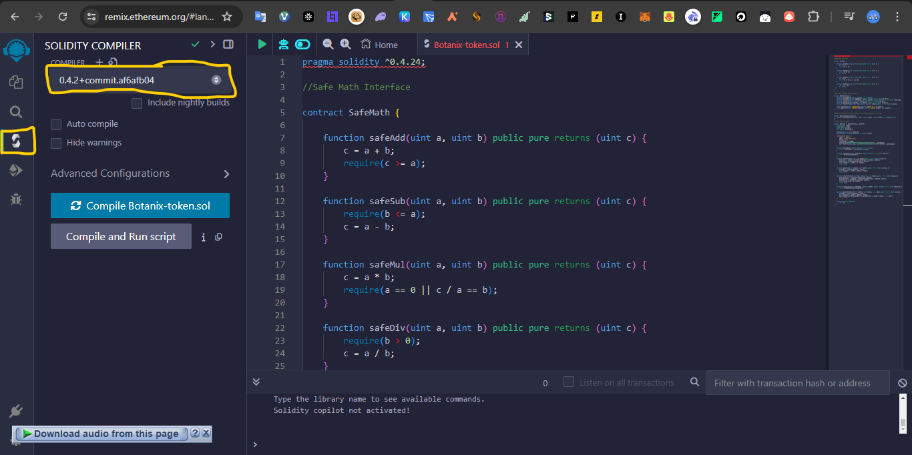

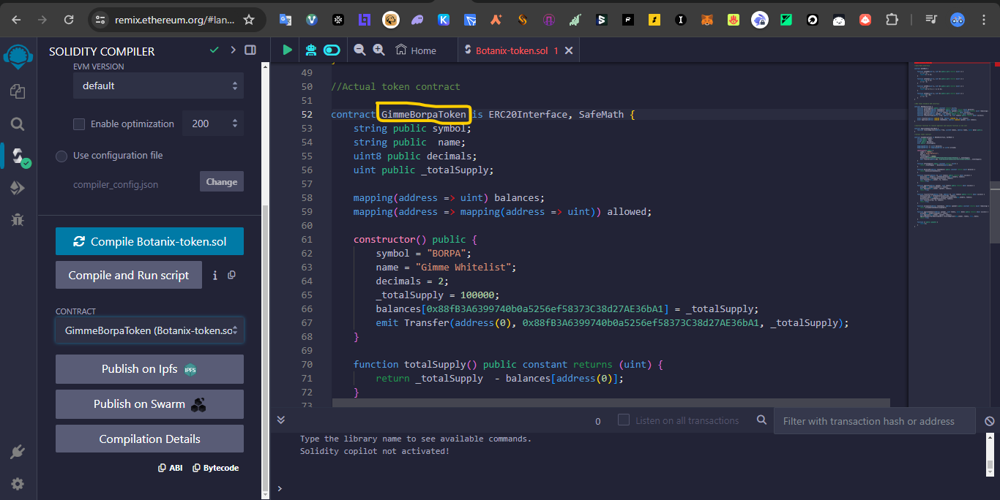

### Deploy it using injected Web3 (make sure to select Botanix testnet on MetaMask before compiling the contract) and select the right contract to be deployed. Approve the transaction from MetaMask.

**Note:** *We need to deploy the main token contract, select the name of the contract appropriately under the contracts section before deploying the contract (Here: GimmeBorpaToken)*

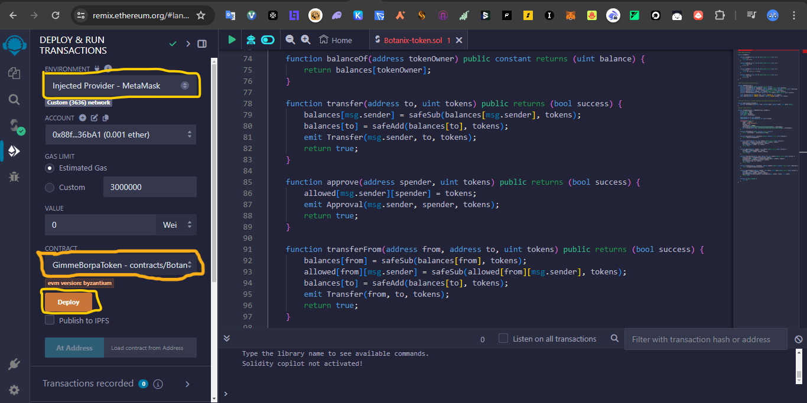

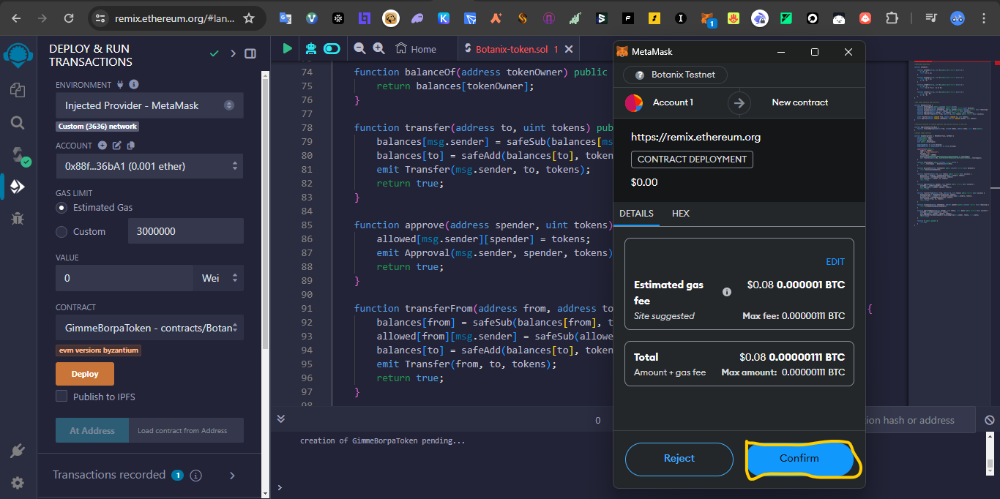

### Copy Your Token Contract Address
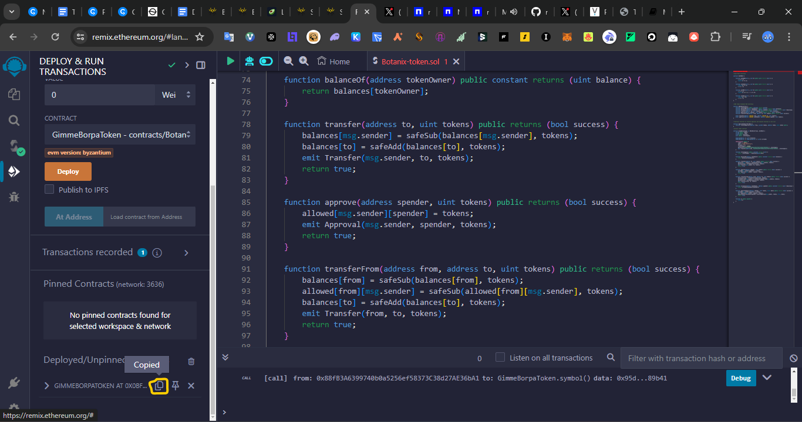

### Import Token Address to Metamask:
Open Metamask, go to the Token tab and click on the Import Tokens button. Paste the contract’s address in the first field. Metamask will fetch the Token Symbol and decimals automatically.

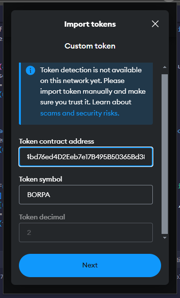
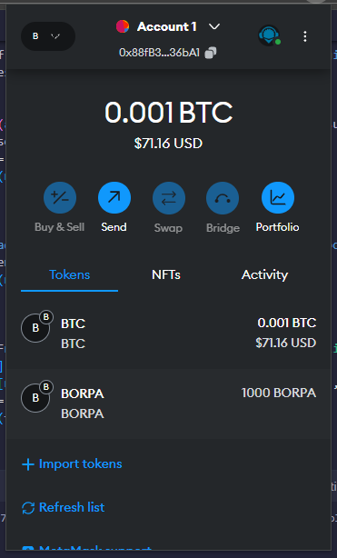

### Congratulations. You have successful deploy a token Contract on the Spiderchain 🎉

 

# Enable Trading with AvocadoSwap
Go to <https://avocadoswap.io/#/pool> Click on Add Liquidity. Next, click on Select Currency and paste the copied contract’s address in the search bar. AvocadoSwap will find your token that you just deployed. Simply click on "Add". 
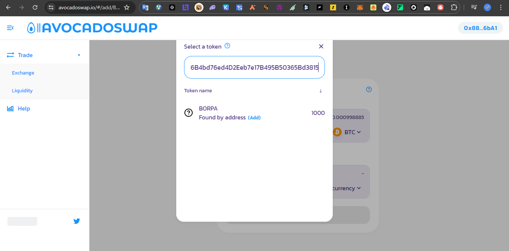

## Provide the first liquidity which will set the trading price of the token. Approve token and supply

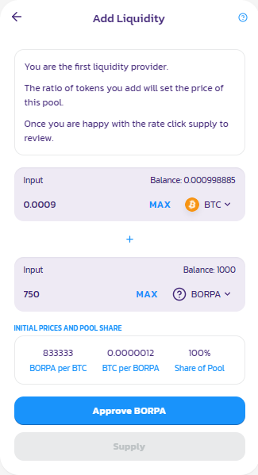

## Click on Create Pool and Supply

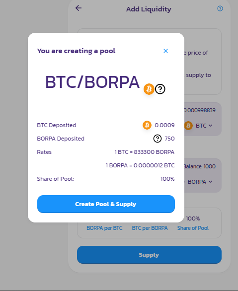

*In case the gas fee is too high, you can try to change it in MetaMask, your transaction should still go through.*

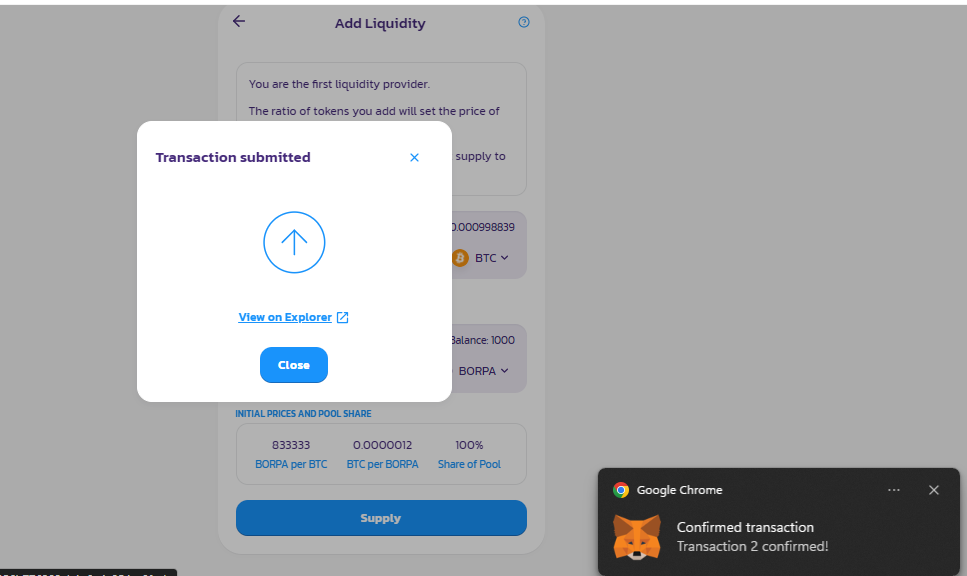

*You can verify your transaction and even download a custom receipt in PDF format. Very cool!* 😎

# Congratulations, you have now provided liquidity for your own created token! Other people can now start to trade your personalized token! 🎉🎉

